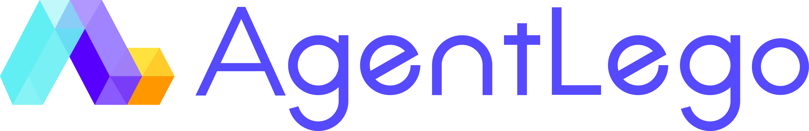

English | [简体中文](/README_zh-CN.md)

<!-- @import "[TOC]" {cmd="toc" depthFrom=1 depthTo=6 orderedList=false} -->

<!-- code_chunk_output -->

- [Introduction](#introduction)
- [News](#news)
- [Demos](#demos)
- [Quick Starts](#quick-starts)
  - [Installation](#installation)
  - [Supported Tools](#supported-tools)
- [Licence](#licence)

<!-- /code_chunk_output -->

## Introduction

 *AgentLego*  is an open-source library of versatile tool APIs to extend and enhance large language model (LLM) based agents, with the following highlight features:

- **Rich set of tools for multimodal extensions of LLM agents** including visual perception, image generation and editing, speech processing and visual-language reasoning, etc.
- **Flexible tool interface** that allows users to easily extend custom tools with arbitrary types of arguments and outputs.
- **Easy integration with LLM-based agent frameworks** like [LangChain](https://github.com/langchain-ai/langchain), [Transformers Agents](https://huggingface.co/docs/transformers/transformers_agents), [Lagent](https://github.com/InternLM/lagent).
- **Support tool serving and remote accessing**, which is especially useful for tools with heavy ML models (e.g. ViT) or special environment requirements (e.g. GPU and CUDA).

## News

## Demos

## Quick Starts

### Installation

### Supported Tools

## Licence

This project is released under the [Apache 2.0 license](LICENSE). Users should also ensure compliance with the licenses governing the models used in this project.
